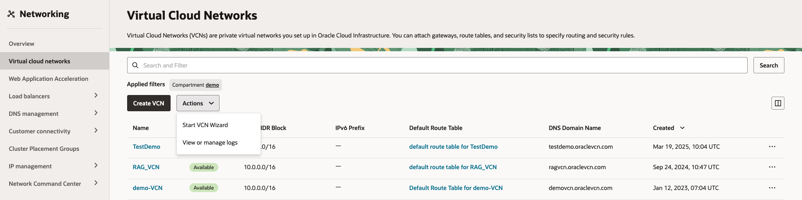
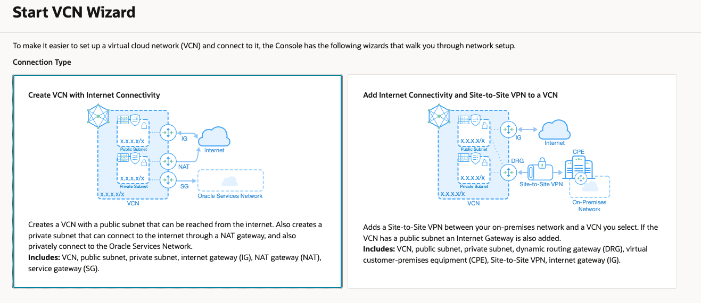
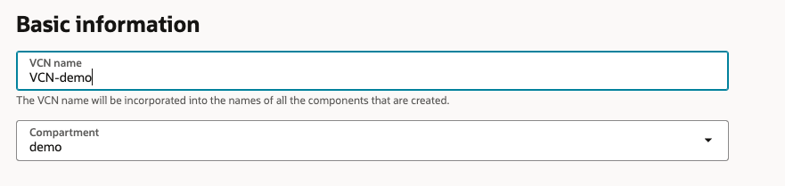
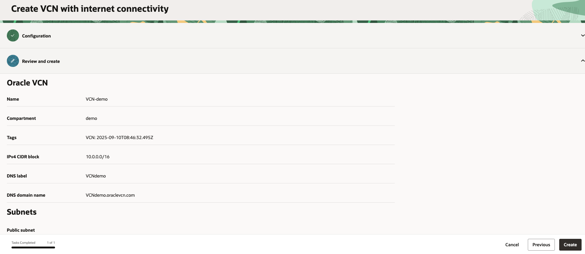
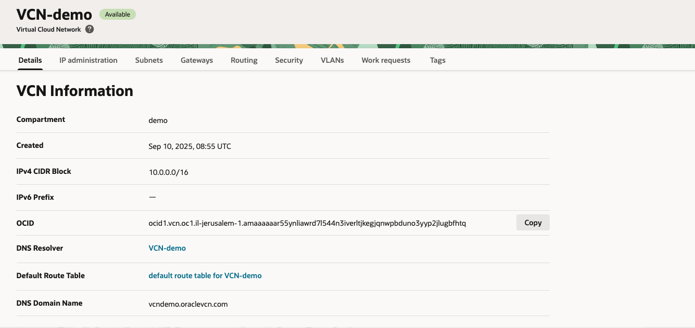

# Create VCN
1. Open the navigation menu and click **Networking** &rarr; **Virtual Cloud Networks** 

2. Click on **Action** -> **Start VCN Wizard**

    

3. Choose **Create VCN with Internet Connectivity**

    

4. Fill the name of the VCN and leave everything else as **Default**

    

5. Scrolldown and click on **Next**

6. Review and click on **Create**

     

7. Once done, click on **View VCN** to see your new Virtual Cloud Network

     