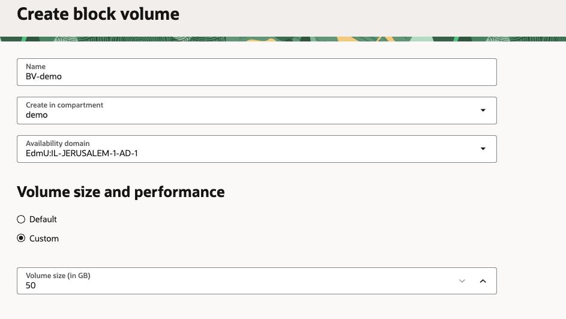
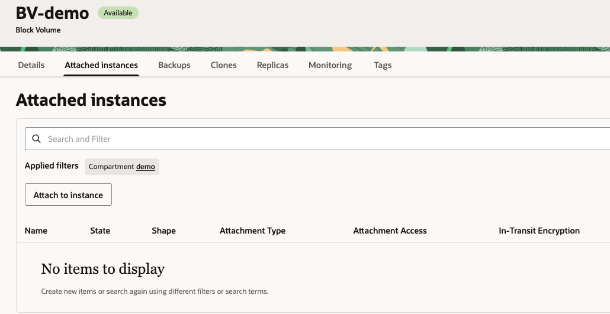
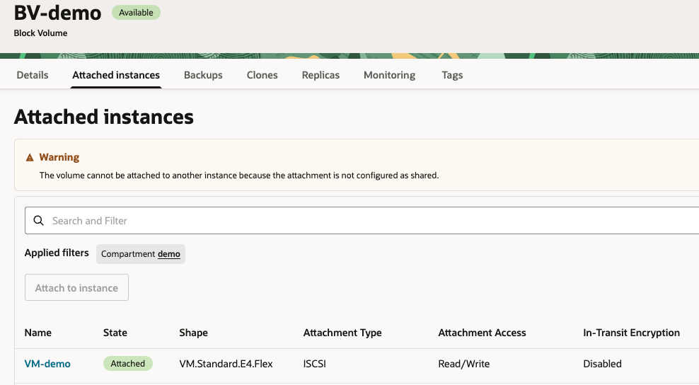
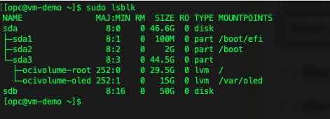
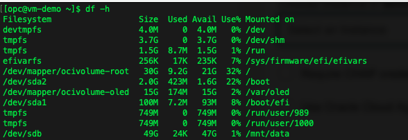

# Create a Block Volume and attach it to an Instance
### Block volumes are detachable block storage devices that you can use to dynamically expand the storage capacity of an instance.
<br>

### Create Block Volume

1. Open the navigation menu and click **Storage**. Under **Block Storage**, click **Block Volumes**

2. Click **Create block volume**

    

3. Provide the following values: <br>
    (1) **Name:** BV-demo<br>
    (2) **Create in compartment:** demo <br>
    (3) Under **Volume size and performance** select **Custom** and enter **Volume size** of *50GB*.

    

4. Keep all values **Default**, and click **Create Block Volume**. <br>

### Attaching the Block Volume to an Instance

1. Open the new **Block Volume** we just created

2. In the top panel click the **Attached Instances** tab, then click **Attach to Instance**

    

3. Provide the following values: <br>
    (1) **Attachment type**: ISCSI <br>
    (2) **Access Type**: Read/Write <br>
    (3) From the **instance** dropdown list, select your compute instance<br>
    (4) Check **Use Oracle Cloud Agent to automatically connect to iSCSI-attached volumes** box <br>

    

4. Click **Attach**

5. Once ready. you instance will appear in the list:

    

6. Connect to the instance by running the following command on your terminal:<br>
        - [Using Cloud Shell](../SSH/cloud_shell.md) <br>
        - [Using Windows](../SSH/windows.md) <br>
        - [Using Linux](../SSH/linux.md) <br>

7. Verify that the disk has been successfully attached by executing the following command:
    ```
    sudo lsblk
    ```
    Note: the device name /dev/sdb may differ depending on your setup. Use the output of lsblk to confirm
    

8. Format and mount the volume by executing the following commands:
    ```
    sudo mkfs.ext4 /dev/sdb
    sudo mkdir /mnt/data
    sudo mount /dev/sdb /mnt/data
    ```

9. Run the following command to verify that the disk appears in the list:
    ```
    df -h
    ```

    