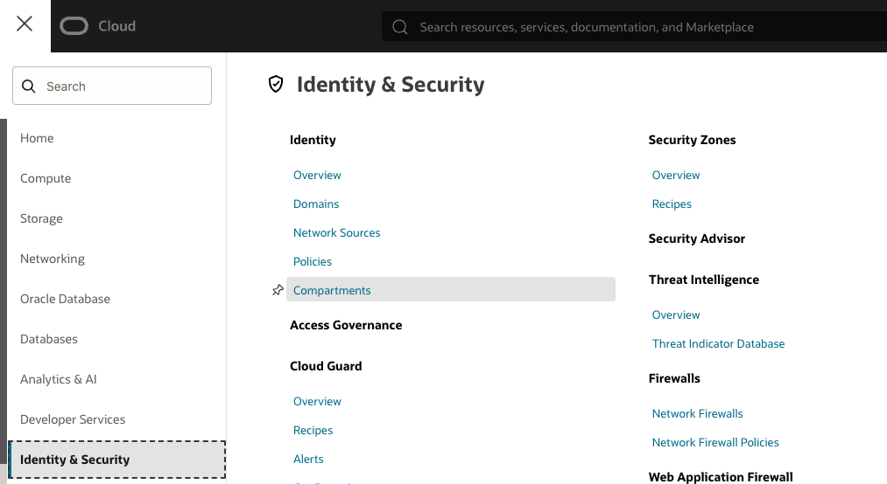

# Create Compartment
### Create compartments in an IAM tenancy to organize and isolate your cloud resources.

1. Open the navigation menu and click **Identity & Security**. Under **Identity**, click **Compartments**

2. To create the compartment in the tenancy (root compartment) click **Create Compartment**

3. Enter the following information:
    1. **Name:** demo
    2. **Description:** demo compartment
    3. **Parent Compartment:** Keep the default value which is the root compartment
    4. **Tags:** Skip this option

4. Click **Create Compartment**

