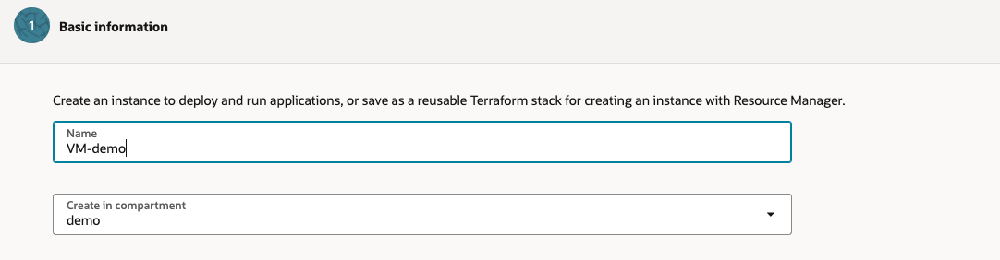
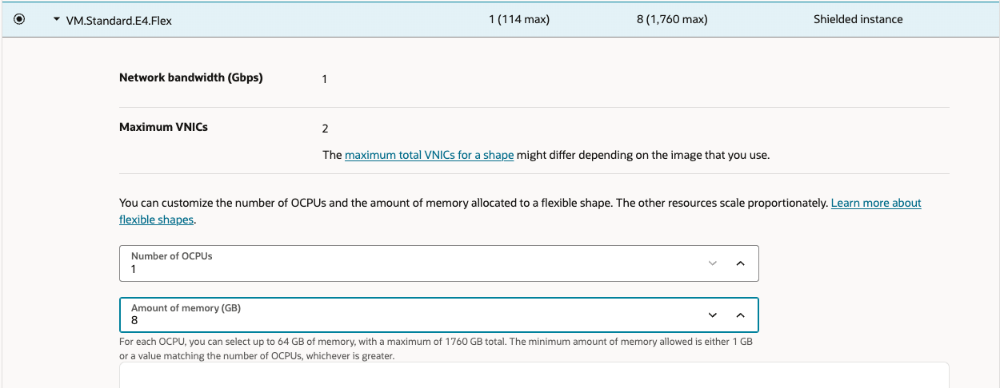
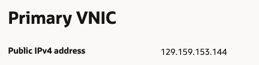

# Create Compute Intance
1. Open the navigation menu and click **Compute** &rarr; **Instances**

2. Select the **'demo'** compartment, then click **Create Instance**

    

3. Enter a name for the instance

    

4. Under **Image and Shape** section, keep the default **Oracle Linux** image and the **VM.Standard.E4.Flex** shape

    

5. Under **Shape** Click on **Change Shape**. 

6. Choose  **AMD** -> **VM.Standard.E4.Flex** with **1 OCPU** and **8 GB of Memory**

7. Click on **Advanced options** and scroll down until you reach **Oracle Cloud Agent**. Add the following to your stack:

7. Click **Next** to reach **Networking**

8. For **Primary Network** Select the VCN we created earlier today, and under **Subnet**, select its Public Subnet.

     

9. Scroll down and  Click **Download Private Key** to save the private key on your computer (Optionally, click **Download Public Key** to reptetive use in the future)

    

9. Click **Next** to reach **Create**. Review and click

10. Once done. Find and copy the **Public IPv4 address** and save it for later use

    

11. You can connect to the instance by running the following command on your terminal: 
        - [Using Cloud Shell](../SSH/cloud_shell.md)  
        - [Using Windows](../SSH/windows.md)  
        - [Using Linux](../SSH/linux.md)  

