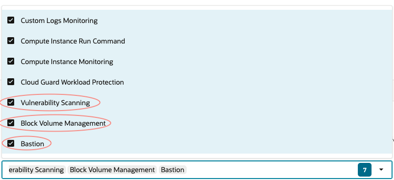

# Create Compute Intance
1. Open the navigation menu and click **Compute** &rarr; **Instances**

2. In the Compartment dropdown, choose **demo**, then click **Create Instance**

    

3. Enter a name for the instance

    

4. Under **Image and Shape** section, keep the default **Oracle Linux** image

    

5. In the **Shape** section, click **Change Shape**

6. Choose  **AMD** -> **VM.Standard.E4.Flex** with **1 OCPU** and **8 GB of Memory**

7. Click on **Advanced options** and scroll down until you reach **Oracle Cloud Agent**. Add the following to your stack:

8. Click **Next** to reach **Networking**

9. For **Primary Network**, select the VCN we created earlier today. Under **Subnet**, choose its Public Subnet.

     

10. Scroll down and Click **Download Private Key** (required) to save it on your computer. Optionally, **Download Public Key** if you plan to reuse it later.

    

11. Click **Next** to reach **Create**. Review and click

12. Once done. Find and copy the **Public IPv4 address** and save it for later use

    

13. To connect to the instance, use one of the following guides based on your environment: 
        - [Using Cloud Shell](../SSH/cloud_shell.md)  
        - [Using Windows](../SSH/windows.md)  
        - [Using Linux](../SSH/linux.md)  

