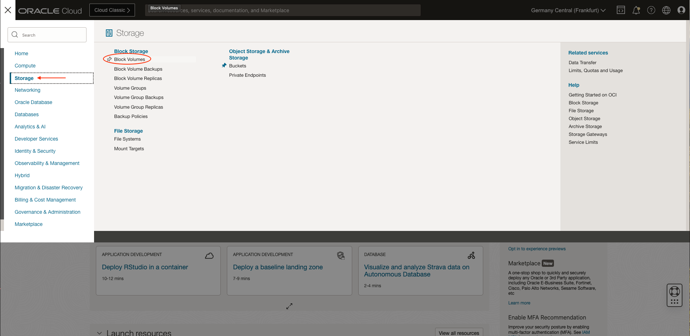
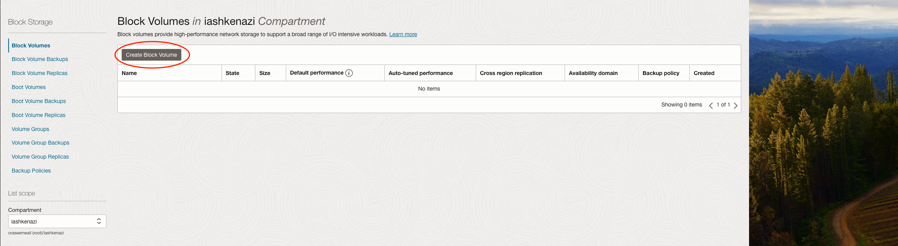
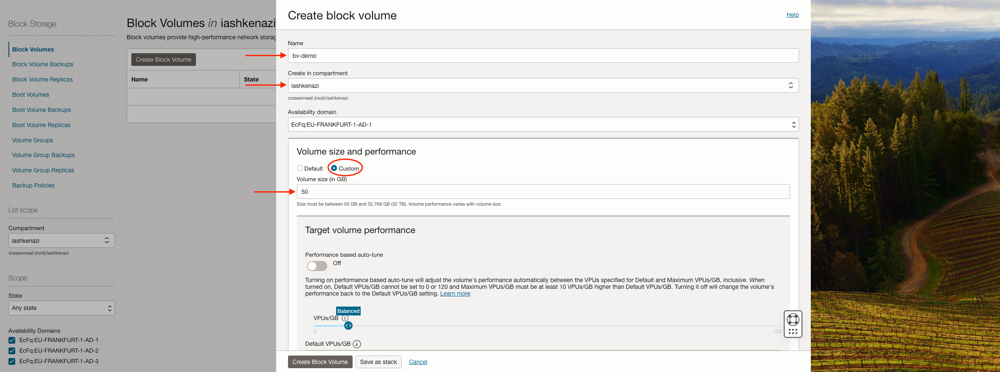
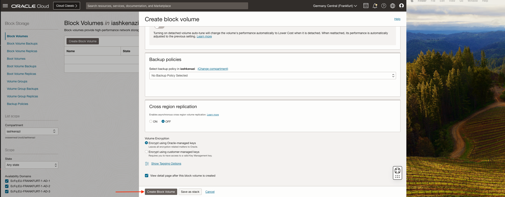
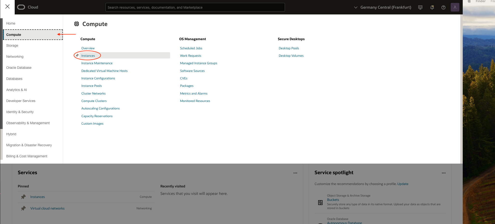
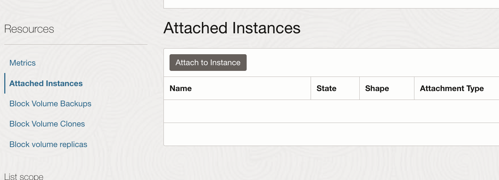
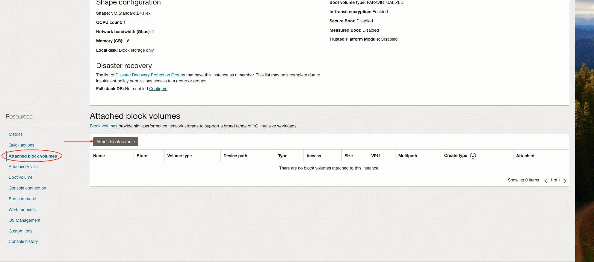
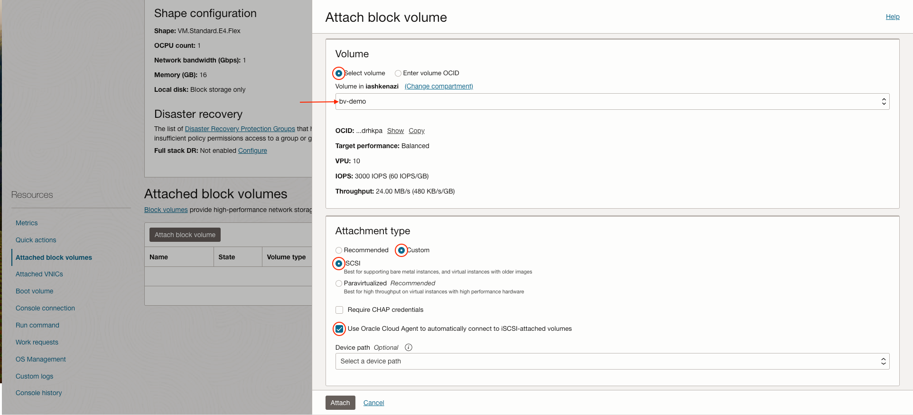
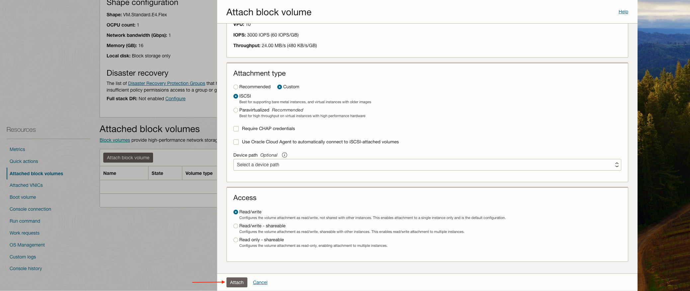

# Create a Block Volume and attach it to an Instance
### Block volumes are detachable block storage devices that you can use to dynamically expand the storage capacity of an instance.
<br>

### Create Block Volume

1. Open the navigation menu and click **Storage**. Under **Block Storage**, click **Block Volumes**

    

2. Click **Creating a Block Volume**

    

3. In the **Create block volume**, provide the following values: <br>
    (1) Enter the **Name:** *bv-demo* <br>
    (2) **Create in compartment:** *demo* <br>
    (3) Under **Volume size and performance** select **Custom** and enter **Volume size** of *50GB*.

    

5. Keep the **Backup policies** and **Cross region replication** at their default values, and click **Create Block Volume**.

    


### Attaching the Block Volume to an Instance

1. Open the navigation menu and click **Compute**. Under **Compute**, click **Instances**

    

2. In the **Instances** list, click the name of the instance that you want to attach a volume to

    

3. In the **Resources**, click **Attached block volumes** and then click **Attach block volume**

    

4. Provide the following values: <br>
    (1) Under **Volume** select **Select volume** and then select the volume from the Volume list <br>
    (2) Under **Attachment type** select **Custom**, **ISCSI** and **Use Oracle Cloud Agent to automatically connect to iSCSI-attached volumes** <br>

    

5. Keep the **Access** at its default value, and click **Attach**

    

6. Connect to the instance by running the following command on your terminal:<br>
        - [Using Cloud Shell](./SSH/cloud_shell.md) <br>
        - [Using Windows](./SSH/windows.md) <br>
        - [Using Linux](./SSH/linux.md) <br>

7. Verify that the disk has been successfully attached by executing the following command:
    ```
    sudo lsblk
    ```

8. Format and mount the volume by executing the following commands:
    ```
    sudo mkfs.ext4 /dev/sdb
    sudo mkdir /mnt/data
    sudo mount /dev/sdb /mnt/data
    ```

9. Run the following command to verify that the disk appears in the list:
    ```
    df-h
    ```
