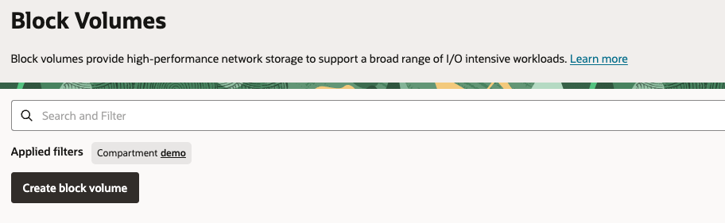
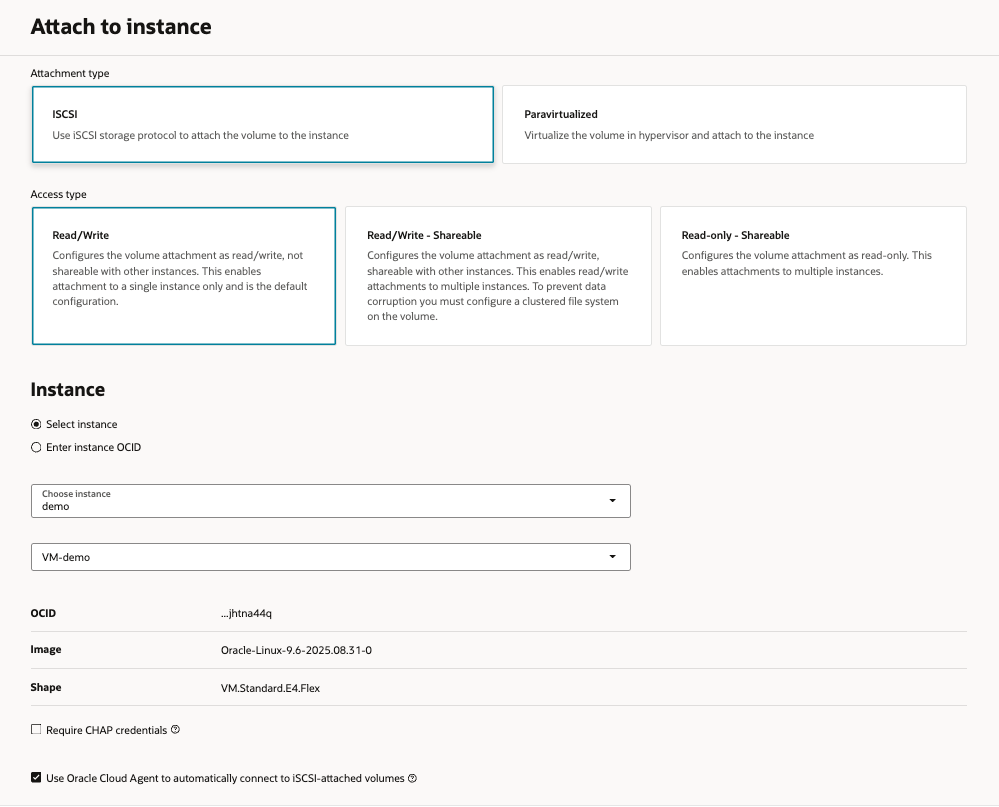

# Create a Block Volume and attach it to an Instance
### Block volumes are detachable block storage devices that you can use to dynamically expand the storage capacity of an instance.
<br>

### Create Block Volume

1. Open the navigation menu and click **Storage**. Under **Block Storage**, click **Block Volumes**

    

2. Click **Creating a Block Volume**

    

3. In the **Create block volume**, provide the following values: <br>
    (1) Enter the **Name:** *bv-demo* <br>
    (2) **Create in compartment:** *demo* <br>
    (3) Under **Volume size and performance** select **Custom** and enter **Volume size** of *50GB*.

    

5. Keep the **Backup policies** and **Cross region replication** at their default values, and click **Create Block Volume**.

    


### Attaching the Block Volume to an Instance

1. Open the new **Block Volume** we just created

2. In the left panel click on **Attached Instances**, and click on **Attach to Instance** button

    

3. Provide the following values: <br>
    (1) Under **Attachment type** select **ISCSI** <br>
    (2) Under **Access Type** select **Read/Write** <br>
    (3) Choose your instance from the drop down list<br>
    (4) Check the box **Use Oracle Cloud Agent to automatically connect to iSCSI-attached volumes** <br>

    

4. Click **Attach**

5. Connect to the instance by running the following command on your terminal:<br>
        - [Using Cloud Shell](./SSH/cloud_shell.md) <br>
        - [Using Windows](./SSH/windows.md) <br>
        - [Using Linux](./SSH/linux.md) <br>

6. Verify that the disk has been successfully attached by executing the following command:
    ```
    sudo lsblk
    ```

7. Format and mount the volume by executing the following commands:
    ```
    sudo mkfs.ext4 /dev/sdb
    sudo mkdir /mnt/data
    sudo mount /dev/sdb /mnt/data
    ```

8. Run the following command to verify that the disk appears in the list:
    ```
    df-h
    ```
