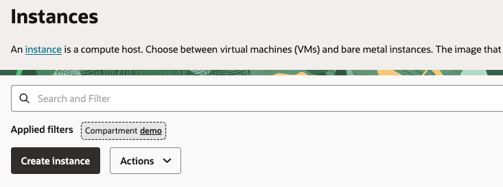
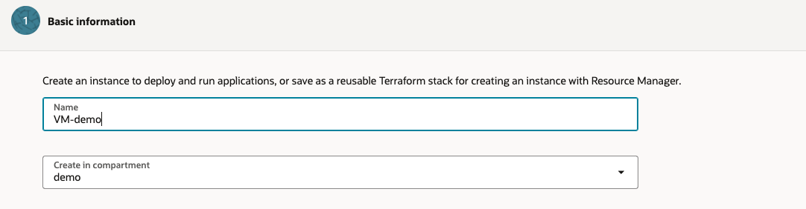
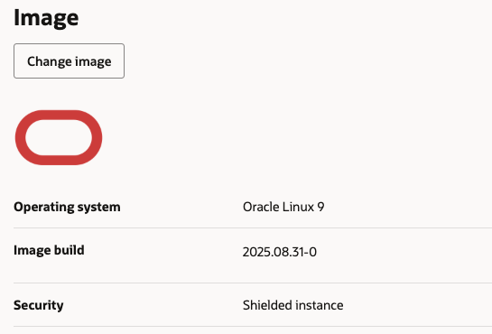
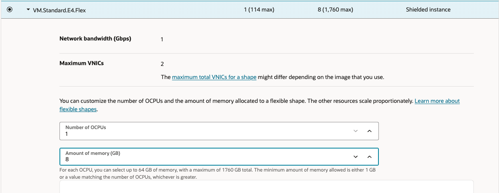
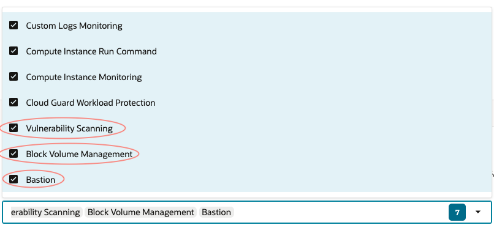
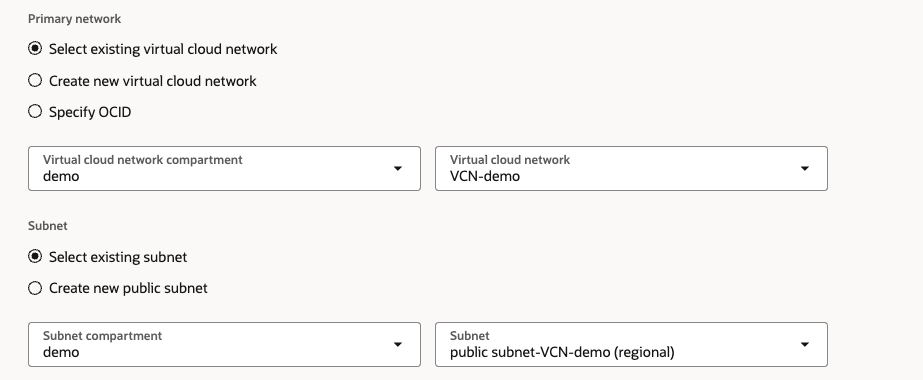
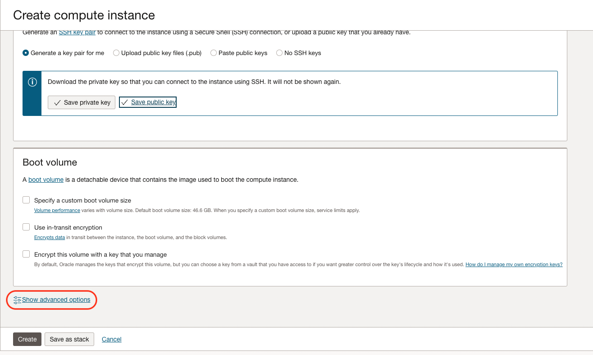
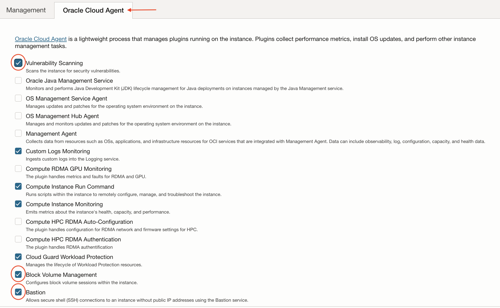

# Create Compute Intance
1. Open the navigation menu and click **Compute** &rarr; **Instances**

    

2. Click **Create Instance**

    

3. Enter a name for the instance

    

4. In the **Image and Shape** section, keep the default **Oracle Linux** image and the **VM.Standard.E4.Flex** shape

    

5. Select the VCN you want and make sure to place on in the Public Subnet

     

6. Save the private key and the public key

    

7. Click on Create

    

8. Copy the public address

    

