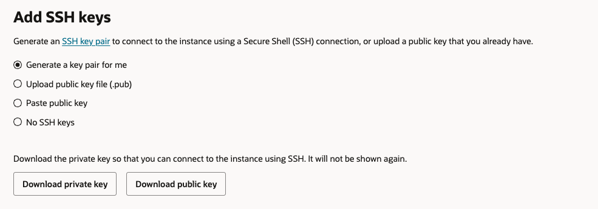

# Create Compute Intance
1. Open the navigation menu and click **Compute** &rarr; **Instances**

    

2. Click **Create Instance**

    

3. Enter a name for the instance and select the compartment to create the instance in

    

4. In the **Image and Shape** section, keep the default **Oracle Linux** image and the **VM.Standard.E4.Flex** shape

    

5. Under **Virtual Cloud Network**, select the VCN we created earlier today, and under **Subnet**, select its Public Subnet.

     

6. Click **Save Private Key**, and then save the private key on your computer (Optionally, click **Save Public Key** and then save the public key as well)

    

7. Click **Show advanced options**

    

8. On the **Oracle Cloud Agent** tab, choose **Vulnerability Scanning**, **Block Volume Management** and **Bastion** plugins

    

9. Click **Create**

    

10. You can connect to the instance by running the following command on your terminal:
        - [Using Cloud Shell](./SSH/cloud_shell.md)
        - [Using Windows](./SSH/windows.md)
        - [Using Linux](./SSH/linux.md)

10. Copy the **Public IP address** and save it for later use

    

